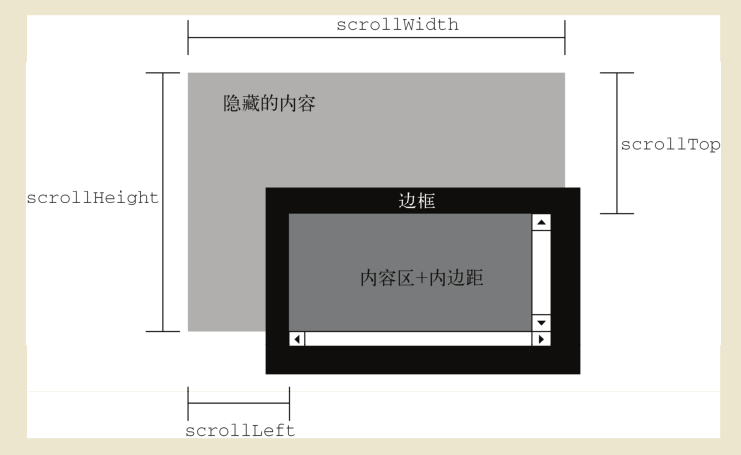
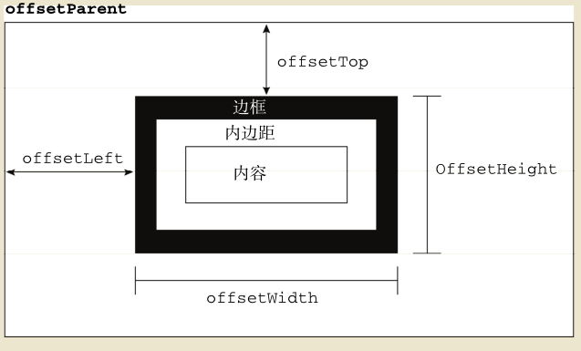

## Client(客户端)、Scroll(滚动)、Offset(偏移)

`client` 和 `scroll` 系列属性为 `Element` 对象的属性

`offset`系列属性为`HTMLElement` 接口属性

### 1、 Client 指的是元素内容(可视区)及其内边距所占的空间大小，(不包括边框、外边距、滚动条)，该系列属性返回值都为只读属性，并且返回值会四舍五入

- `element.clientHeight` 元素内部的高度(`CSS height + CSS padding - 水平滚动条(如果存在)`)，返回一个整数(不带单位)

- `element.clientWidth` 元素内部的宽度(`CSS width + CSS padding - 垂直滚动条(如果存在)`), 返回一个整数(不带单位)

- `element.clientLeft` 表示一个元素的左边框的宽度。如果元素的文本方向是从右向左（RTL, right-to-left），并且由于内容溢出导致左边出现了一个垂直滚动条，则该属性包括滚动条的宽度。clientLeft 不包括左外边距和左内边距

- `element.clientTop` 一个元素顶部边框的宽度。不包括顶部外边距或内边距。

- 如果需要使用小数值，可以使用`Element.getBoundingClientRect()`方法
#### 示例

### 2、Scroll 指的是包含滚动内容的元素的大小，属性值会四舍五入

- scrollHeight：元素内容总高度(只读属性)，包括overflow属性导致的视图中不可见内容。包括元素的 padding，不包括margin。
- scrollWidth：元素内容的总宽度(只读属性)，包括滚动条中看不到的内容。
- scrollLeft：被隐藏在内容区域左侧的像素数(可以设置属性值改变元素位置)。通过设置这个属性可以改变元素的滚动位置
- scrollTop：被隐藏在内容区域上方的像素数(可以设置属性值改变元素位置)。通过设置这个属性可以改变元素的滚动位置
- window.scrollTo(x, y); 把内容滚动到指定的坐标 window.scrollTo(15, 15);
- 判断元素是否滚到底`element.scrollHeight - element.scrollTop === element.clientHeight`

#### 示例

### 3、Offset 通过下列四个属性可以获取到元素的偏移量

- offsetHeight: 元素在垂直方向上占用的空间大小，以像素计。offsetHeight = height + border(上下) + padding(上下)
包括元素的高度、 （可见的） 水平滚动条的高度、上边框高度和下边框高度
- offsetWidth: 元素在水平方向上占用的空间大小，以像素计。 offsetWidth = width + border(左右) + padding(左右)
包括元素的宽度、 （可见的）垂 直滚动条的宽度、左边框宽度和右边框宽度
- offsetLeft: 元素的左外边框至包含元素的左内边框之间的像素距离(包含元素指的是最近的带有定位的元素,所以不一定是父亲元素)
- offsetTop：元素的上外边框至包含元素的上内边框之间的像素距离(包含元素指的是最近的带有定位的元素,所以不一定是父亲元素)
- offsetWidth和offsetHeight 获取的是元素自身的尺寸(跟其他元素没关系) offsetLeft和offsetTop在计算距离时,包含元素的边框不计算在内
- 这些属性在使用的时候尽量保存在一个变量中以提高性能(因为每次访问它们都需要重新计算)
- offsetParent 返回对象的父级(但是不一定是亲父亲,而是最近的带有定位的父亲/爷爷/爷爷的爷爷,如果没有那么就是body)
- 不能使用width和height left和top 的原因是只有在行内的才能获取到
- `

` 只能得到这些，所以不使用 还有就是offset家族返回的是数字(并且是只读的) 所以更好用
- 因为height等值是可读写的,所以综合上面就是 使用offset家族来获取数据 使用height等来改写

#### 示例

* 封装client函数
function client() {
        if(window.innerWidth != null)  // ie9 +  最新浏览器
        {
            return {
                width: window.innerWidth,
                height: window.innerHeight
            }
        }
        else if(document.compatMode === "CSS1Compat")  // 标准浏览器
        {
            return {
                width: document.documentElement.clientWidth,
                height: document.documentElement.clientHeight
            }
        }
        return {   // 怪异浏览器
            width: document.body.clientWidth,
            height: document.body.clientHeight

        }
    }
    //用法
    document.write(client().width);

    
* 检查屏幕宽度
* clientWidth 返回的是可视区域的大小 浏览器内部的大小
* window.screen.width 返回的是电脑屏幕分辨率大小

//页面滚动事件 onscroll
window.onscroll = function() {
    var scrollTop = window.pageYOffset || document.documentElement.scrollTop
    || document.body.scrollTop || 0;
        //兼容
        document.title = scrollTop;
        console.log(scrollTop);
    }

// 封装自己的scroll函数
function scroll() {
    if(window.pageYOffset != null) { //  ie9+ 和其他浏览器
        
        return {
            left: window.pageXOffset,
            top: window.pageYOffset
        }
    }
    else if(document.compatMode == "CSS1Compat") { // 声明的了 DTD 声明<!DOCTYPE html>
        return {
            left: document.documentElement.scrollLeft,
            top: document.documentElement.scrollTop
        }
    }
    return { //  剩下的肯定是怪异模式的
        left: document.body.scrollLeft,
        top: document.body.scrollTop
    }
}
